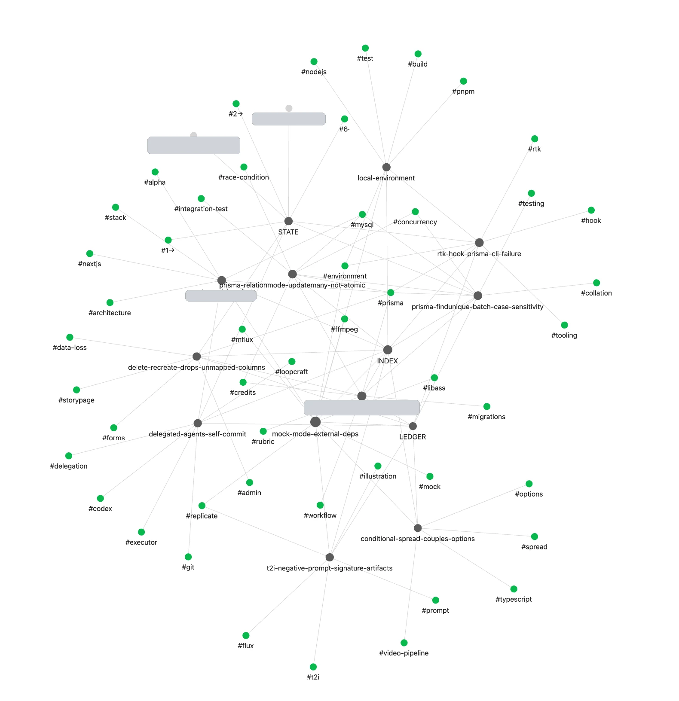
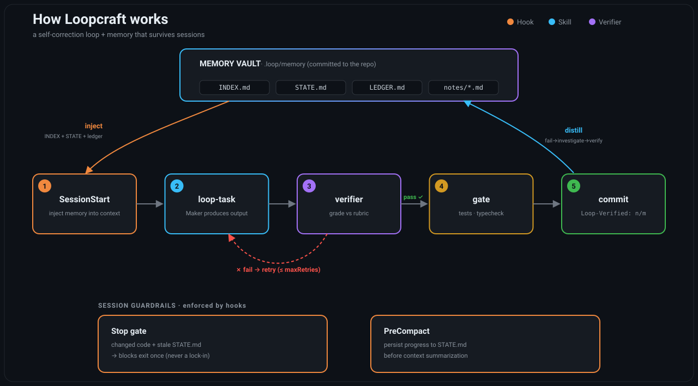
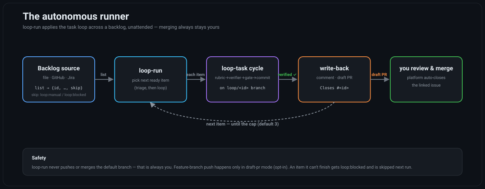

<p align="center">
  
</p>

# Loopcraft

**English** | [한국어](README.ko.md) | [日本語](README.ja.md) | [中文](README.zh-CN.md)

Loop engineering plugin for [Claude Code](https://claude.com/claude-code) — instead of steering the model with ever-longer prompts, design loops where it **self-corrects from environment feedback** and **accumulates memory across sessions**.

Inspired by [Lance Martin's loop engineering work](https://x.com/RLanceMartin/article/2064397389189071163) and [Andrej Karpathy's LLM Wiki pattern](https://gist.github.com/karpathy/442a6bf555914893e9891c11519de94f): self-improvement is a property of the *system*, not the model. Loopcraft builds that system as an installable plugin.

## Why Loopcraft?

Every Claude Code session starts from zero. The context you built up last time — why a test was flaky, the refactor you already tried and abandoned, the quirks of this codebase — is gone the moment the session ends or the window compacts. The usual response is to pour more into the prompt: longer `CLAUDE.md` files, more standing instructions. But steering a model with an ever-growing prompt doesn't scale, and it still won't stop it from forgetting yesterday's work — or from grading its own output too generously.

Loop engineering takes a different position: **self-improvement is a property of the system, not the model.** Instead of a bigger prompt, you build a loop — the model acts, the *environment* pushes back (tests, an independent grader), the model corrects, and whatever was learned is written to durable memory that the next session reads before doing anything. The model doesn't have to get smarter; the system around it has to remember and check.

Loopcraft is that system, packaged as an installable plugin. Reach for it when you:

- work a real project across **many sessions** and keep re-explaining the same context;
- want work **verified against explicit criteria** instead of trusting the model's own "looks good to me";
- run Claude **unattended** and need every result gated and auditable before it reaches `main`;
- are tired of the model **repeating a mistake** it already hit — and solved — last week.

And because the vault is plain markdown rather than a hidden database, that memory stays yours: point Obsidian at `.loop/memory/` and watch the knowledge graph grow, grep it from the terminal, or just read it in a pull request. You can see — and edit — everything the system has learned.

<p align="center">
  <br>
  <sub><i>A real <code>.loop/memory</code> vault in Obsidian's graph view — STATE / INDEX / LEDGER hubs linked to distilled notes and tags.</i></sub>
</p>

## How it works

<p align="center">
  
</p>

The loop closes on two timescales:

- **Within a task** — `loop-task` hands your work to an independent `verifier` that grades it against a rubric, seeing only the output and the criteria — never the maker's reasoning, so it can't be argued into a pass. Fail, and the maker gets the verdict and retries, up to `maxRetries`. Pass, and the work clears your real gates (tests, typecheck) and lands as a commit stamped `Loop-Verified: n/m`.
- **Across sessions** — the `.loop/memory` vault travels with the repo. `SessionStart` injects it, so Claude begins already knowing what past sessions learned; when something fails, `distill` turns it into a *verified*, reusable rule; and the Stop gate and PreCompact hooks make sure progress is written down before a session ends or the context is summarized away. Nothing gets re-learned from scratch.

And it scales out to a whole backlog: **`loop-run`** applies that same task loop to each item — read from a pluggable source (file / GitHub / Jira) and written back as a comment or a draft PR — unattended, while merging to your default branch stays your call.

<p align="center">
   branch, writes back a comment or a draft PR with Closes #<id>, then you review and merge; loop-run never merges the default branch" width="900">
</p>

## Concepts

**Loop engineering** is the idea underneath everything here: you improve outcomes by shaping the *loop* the model runs in — act, get feedback from the environment, correct, and write down what was learned — rather than by hand-tuning an ever-larger prompt. The leverage moves from the model's weights to the system around it: memory, verification, and gates. A weaker model in a good loop beats a stronger model with no memory and no checks. (The framing draws on Lance Martin's work on loop/context engineering and Andrej Karpathy's LLM Wiki pattern.)

The rest of the vocabulary this README uses:

- **Maker** — whoever produces the work in a `loop-task`: Claude, acting on your request. The maker never grades itself.
- **Verifier** — an independent subagent that scores the maker's output against a rubric. It sees only the output and the criteria — never the maker's reasoning — so it can't be argued into a pass. (`agents/verifier.md`)
- **Rubric** — a small markdown file in `.loop/rubrics/` that declares, for a class of work, the pass/fail criteria and *how* each one is verified (a command to run, a file to inspect). It's the contract the verifier grades against. Example: a `code` rubric might require "tests pass", "no secrets committed", "public functions documented".
- **Gate** — a real command from your project (`npm test`, a typecheck, `./tests/run.sh`) that must exit 0 before work is committed. Rubrics judge quality; gates enforce that it actually runs.
- **Vault** — `.loop/memory/`, the plain-markdown store that travels with the repo: `INDEX.md` (map + stats), `STATE.md` (session handoff), `LEDGER.md` (failure log), and `notes/` (distilled rules).
- **Distill** — the 5-stage protocol (Fail → Investigate → Verify → Distill → Consult) that turns a failure into a *verified*, reusable note in the vault, instead of a lesson you learn twice.
- **Loop-Verified: n/m** — a commit trailer stamped by `loop-task`: n of m rubric criteria met, judged by the independent verifier. Your audit trail.
- **Backlog source** — where `loop-run` reads its work queue: a document section (`file`, the default) or an external system (`github` / `jira` / `command`) you wire up at `loop-init`.
- **Adapter** — a small script (e.g. `.loop/adapters/github.sh`) implementing the `list`/`report` contract for one provider. The core stays vendor-neutral; the adapter is the only place `gh`/`jira` is ever called. Copy it as a template for a new provider.
- **Write-back** — what `loop-run` does with a result on the source: `none`, a verdict `comment`, or a `draft-pr` that links `Closes #<id>` so your merge auto-closes the item.

## What you get

| Component | What it does |
|-----------|--------------|
| **SessionStart hook** | Injects your project's memory (`INDEX.md` + `STATE.md`) into every new session, plus a reminder for unresolved failures in the ledger. Claude starts already knowing what past sessions learned. |
| **Stop gate hook** | *Write before walking away*: if code changed but `STATE.md` wasn't updated, ending the session is blocked once with a reminder. Also blocks ending mid-verification when a loop task marker is present. Max one block per session — never a lock-in. |
| **PreCompact hook** | Right before context compaction, reminds the model to persist progress into `STATE.md` so nothing is lost to summarization. |
| **`/loopcraft:distill` skill** | A 5-stage failure-to-knowledge protocol: **Fail → Investigate → Verify → Distill → Consult**. Failures become *verified*, general rules in your vault — merged into existing notes first, never duplicated. |
| **Obsidian-compatible vault** | `.loop/memory/` is plain markdown with YAML frontmatter and `[[wikilinks]]`. Open it as an Obsidian vault and watch the knowledge graph grow. No app dependency — the loop only needs files. |
| **`verifier` subagent** | An independent grader that scores your work against a rubric — seeing only the output and criteria, not your reasoning. Prevents maker bias from clouding judgment. |
| **`/loopcraft:loop-task` skill** | Maker → verifier → retry → gate → commit cycle: submit a task description, get a verdict summary, then automatically stamp `Loop-Verified: n/m` in the commit trailer for audited work. |
| **`/loopcraft:loop-init` skill** | Scans your repo and interviews you to scaffold `.loop/` with configured gates and a rubric starter. One-command project onboarding. |
| **`/loopcraft:loop-run` skill** | Autonomously traverses your backlog unattended — selects items, runs loop-task cycles, gates them, and commits all work to a worktree. All commits stay in the worktree; merging to main always remains your call — the system only executes, it never pushes to the repo. |

Zero runtime dependencies: `bash + git + grep/sed/awk`. Escape hatch: set `LOOP_DISABLE=1` to disable all hooks.

## See it in action

*An illustrative `loop-task` cycle. The rubric is the one loopcraft actually ships, and the verdict follows the verifier's real output format — but the run below is a representative example, not a captured log.*

Say you're adding a new branch to a hook script. Instead of committing it directly, you route it through the loop:

```
/loopcraft:loop-task Add a LOOP_DISABLE short-circuit to the SessionStart hook
```

`loop-task` matches the changed file (`hooks/scripts/*.sh`) to the **`code`** rubric — five criteria, each with a declared way to check it:

```
1. Gate passes        — ./tests/run.sh exits 0, no `not ok` lines
2. Safety options     — changed scripts declare `set -euo pipefail` (or at least `set -u`)
3. Variables quoted   — path / user-input vars expanded as "$VAR"
4. Tests accompany    — every new branch gets a matching assert_* in tests/run.sh
5. Executable bit kept — files under hooks/scripts/ stay 755+
```

The maker does the work, then hands the diff — and *only* the diff and the rubric, never its own reasoning — to the independent `verifier`. First pass:

```
## Verdict

| # | Criterion           | Verdict | Evidence |
|---|---------------------|---------|----------|
| 1 | Gate passes         | pass    | ./tests/run.sh → exit 0, 0 `not ok` |
| 2 | Safety options      | pass    | line 2: `set -euo pipefail` |
| 3 | Variables quoted    | pass    | diff adds only `"$LOOP_DISABLE"` |
| 4 | Tests accompany     | fail    | new early-return branch, no matching assert_* in the tests/run.sh diff |
| 5 | Executable bit kept | pass    | mode 755 unchanged |

**Unscorable criteria**: none
**Result**: FAIL (4/5)
**FAIL summary**: #4 — the new disable branch ships without a regression test.
```

Because the verifier never saw the maker's reasoning, "it obviously works" carries no weight — only the missing test does. The maker gets just that FAIL summary, adds the `assert_*` case, and re-submits. Second pass:

```
**Result**: PASS (5/5)
```

Now the real gate runs, comes back green, and the work lands with its verdict stamped into the commit:

```
$ git log -1 --format='%s%n%n%b'
Add LOOP_DISABLE short-circuit to SessionStart hook

Loop-Verified: 5/5
```

That `Loop-Verified: 5/5` trailer is the audit trail: five criteria, all met, signed off by a grader that couldn't be argued into it.

> **What it costs.** Every attempt adds one independent grading pass, and a FAIL buys another maker → verifier round (up to `maxRetries`). That overhead *is* the mechanism — which is also why `loop-task` is for non-trivial, verifiable work, not one-line fixes or open-ended exploration. For those, just work normally; the memory hooks keep running regardless.

## Installation

**Option A — marketplace (recommended):**

```
/plugin marketplace add hiphapis/loopcraft
/plugin install loopcraft@loopcraft
```

**Option B — local clone (for development):**

```bash
git clone https://github.com/hiphapis/loopcraft.git
claude --plugin-dir ./loopcraft
```

## Project setup

**Recommended: Use `/loopcraft:loop-init`**

At your repo root, run:

```
/loopcraft:loop-init
```

The skill scans your project structure, interviews you about gates and quality rubrics, then generates `.loop/config.json` and a starter rubric in `.loop/rubrics/`. No manual editing needed.

### Manual setup (optional)

If you prefer to scaffold `.loop/` by hand, run this once at your repo root:

```bash
mkdir -p .loop/memory/notes .loop/rubrics
cat > .loop/config.json <<'EOF'
{
  "gates": ["npm run typecheck", "npm run lint", "npm test"],
  "backlog": { "file": "docs/backlog.md", "section": "Ready to Execute" },
  "rubrics": [],
  "maxRetries": 3,
  "autonomy": { "commit": true, "mainMerge": false, "maxConsecutiveFails": 2 }
}
EOF
printf '# Memory Index\n\n> notes 0 · verified 0%% · updated: YYYY-MM-DD\n\n## debugging\n\n## pattern\n\n## environment\n\n## decision\n' > .loop/memory/INDEX.md
printf '# STATE — session handoff\n\n## Working on\n- (none)\n\n## Next steps\n- (none)\n\n## Open questions\n- (none)\n\n## Recent decisions\n- (none)\n' > .loop/memory/STATE.md
printf '# LEDGER — failure ledger\n\n> stages: fail → investigate → verify → distilled\n\n| date | symptom | stage | note |\n|------|---------|-------|------|\n' > .loop/memory/LEDGER.md
printf '.loop/journal/\n.loop/state/\n' >> .gitignore
```

Adjust `gates` to your project's real commands. Commit `.loop/` — the vault is meant to travel with the repo (worktrees and other machines get it for free).

## Usage

**Every session** — nothing to do. The SessionStart hook injects `INDEX.md` and `STATE.md` automatically; Claude consults accumulated knowledge before acting.

**When something fails** (a test, a build, a wrong assumption):

```
/loopcraft:distill ffmpeg burn-in subtitles invisible on Homebrew builds (no libass)
```

The skill walks through recording the failure in the LEDGER, investigating the cause, **verifying the diagnosis by reproduction or refutation**, distilling it into a general rule (frontmatter carries `verified: true/false` so hypotheses are never confused with facts), and linking it into the vault.

**For auditable work** — use loop-task to route your work through the verifier and gate:

```
/loopcraft:loop-task Refactor migration sanitization to prevent SQL injection
```

The skill submits the task, waits for the verifier's verdict summary, and on pass, stamps the commit trailer with `Loop-Verified: n/m` (n criteria met, m total). Rubrics live in `.loop/rubrics/` — each one declares the verification method and passing criteria.

**Ending a session** — if you changed code but didn't update `STATE.md`, the Stop gate blocks once and tells you what to write down. Update STATE, end cleanly, and the next session picks up exactly where you left off.

**Autonomous backlog runner** — let the system work overnight:

```
/loopcraft:loop-run 3
```

This launches a background session that autonomously picks backlog items, runs loop-task cycles, gates them, and commits to a worktree. You wake up to run journals (`.loop/journal/run-*.md`) and Loop-Verified commits ready for review — cherry-pick what you like into main, discard the rest. The system never merges; all human gatekeeping stays intact.

**Watching it grow** — open `.loop/memory/` in Obsidian for the graph view, or:

```bash
git log --oneline -- .loop/memory/   # what the loop learned, when
```

## Autonomous runner

`loop-run` iterates a backlog unattended, applying the `loop-task` cycle to each item. Two knobs make it fit your setup — the **backlog source** it pulls work from, and the **write-back** it does with each result.

It reads its work queue from a pluggable **backlog source**, chosen during `loop-init`:

- **file** (default) — a document section you designate, e.g. `docs/project-status.md` § "Ready to Execute".
- **github** / **jira** / **command** — loopcraft runs the `list`/`report` commands you configure. The core never calls vendor tools directly; a bundled GitHub adapter (`.loop/adapters/github.sh`) is the reference implementation, and other providers copy it as a template.

`list` emits a normalized JSON array (`id`, `title`, `body`, `ref`, `skip`); `report` receives the outcome via `LOOP_*` env vars. For the GitHub adapter, `skip` is set by a `loop:manual` (manual-only, skip) or `loop:blocked` (previously escalated) label on the issue. In `draft-pr` mode a separate `config.pr` command (a **code-host** concern) opens the PR, so `report` stays task-tracker-only — that lets a Jira `report` and a GitHub `pr` compose.

**Write-back** (`backlog.writeback`, default `none`):

| Mode | Branches | Pushes | On completion |
|------|----------|--------|---------------|
| `none` | one per run | no | nothing |
| `comment` | one per run | no | comments the verdict on the item |
| `draft-pr` | one per item (`loop/<id>`) | feature branch only | pushes, then `config.pr` opens a **draft PR** with `Closes #<id>` |

loopcraft never closes issues or merges to the default branch — a human merges the draft PR and the platform auto-closes the linked issue. Feature-branch push happens only in `draft-pr` mode (opt-in); every other mode stays push-free.

**Test authoring.** When an item needs tests, `loop-run` never lets the maker write them for its own code. Tests default to **[Codex](https://github.com/openai/codex)** (the OpenAI Codex CLI) when it's installed and configured; if Codex isn't available, loopcraft falls back to a **context-isolated subagent** (a fresh Claude agent given only the behavior spec, never the maker's reasoning). Either way the tests are authored independently — they verify behavior, not the implementation. To enable Codex, install and sign in to the [Codex CLI](https://github.com/openai/codex).

### GitHub setup

`loop-init` writes this for you when you pick **GitHub Issue**, but here's the shape — the relevant part of `.loop/config.json`:

```json
"backlog": {
  "source": "github",
  "list": "bash .loop/adapters/github.sh list --label loop:ready",
  "report": "bash .loop/adapters/github.sh report",
  "writeback": "draft-pr",
  "base": "main"
},
"pr": "bash .loop/adapters/github.sh pr"
```

One-time labels (loop-init offers to create them):

```bash
gh label create loop:ready   --description "loopcraft: pick up"
gh label create loop:manual  --description "loopcraft: manual only (skip)"
gh label create loop:blocked --description "loopcraft: escalated"
```

### GitHub, end to end

*A representative `loop-run` against GitHub Issues — illustrative, not a captured log.*

1. **Onboard once.** `loop-init` → choose **GitHub Issue** as the source and **draft-pr** for write-back. It copies the adapter to `.loop/adapters/github.sh`, checks `gh auth`, and creates the labels above.
2. **Queue work.** Add `loop:ready` to the issues you want handled; leave `loop:manual` on anything that needs a human.
3. **Run the loop.**
   ```
   /loopcraft:loop-run 3
   ```
   For each ready issue, `loop-run` reads it as a backlog item, runs the full `loop-task` cycle (rubric → verifier → gate → `Loop-Verified` commit) on a per-item `loop/<id>` branch, then writes back a verdict comment plus a **draft PR** whose body says `Closes #<id>`.
4. **You stay in control.** Review each draft PR; merging it lets GitHub auto-close the linked issue. loopcraft never merges to the default branch and never closes issues itself — an item it can't finish gets `loop:blocked` and is skipped next run.

## Vault format

```
.loop/
├── config.json          # gates, backlog source, retry caps, autonomy limits
├── memory/              # committed to the repo
│   ├── INDEX.md         # map of content + stats (note count, verified %)
│   ├── STATE.md         # session handoff: working on / next / open questions
│   ├── LEDGER.md        # failure ledger: fail → investigate → verify → distilled
│   └── notes/*.md       # distilled rules (YAML frontmatter + [[wikilinks]])
├── journal/             # run logs — gitignored
└── state/               # volatile session markers — gitignored
```

Note frontmatter: `title / tags / category (debugging|pattern|environment|decision) / confidence / verified / created / updated / sources`.

## Everything is markdown — open it in Obsidian

The vault has no database and no app dependency. Every note is plain markdown with YAML frontmatter and `[[wikilinks]]`, so the same files the loop reads are files you can read, grep, diff, and edit by hand.

Point Obsidian at `.loop/memory/` and it becomes a live vault: the graph view shows how distilled rules link together, backlinks surface related failures, and frontmatter (`category`, `verified`, `confidence`) turns into searchable metadata. Nothing about the loop *requires* Obsidian — it's just a good way to *see* what the system has learned. Prefer the terminal? `git log -- .loop/memory/` shows what the loop learned, and when.

## Roadmap

- **Phase 1 — Memory** ✅: hooks, distill protocol, vault.
- **Phase 2 — Self-correction** ✅: verifiable rubrics, an independent verifier subagent that grades outputs without seeing the maker's reasoning, `/loop-task` self-correction cycles, `/loop-init` onboarding interview.
- **Phase 3 — Autonomous runner** (this release): `/loop-run` iterates a backlog unattended — work → verify → gate → commit → distill — with pluggable backlog sources (file/GitHub/Jira) and write-back (comment / draft-PR); commits stay in a worktree; merging to main always requires a human.

## Requirements

- Claude Code with plugin support
- `bash`, `git` (macOS / Linux)

## Testing

```bash
./tests/run.sh   # 28 cases: hook contracts, sanitization, edge cases
```

## License

MIT
